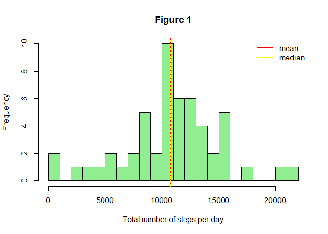
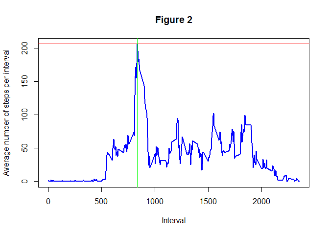
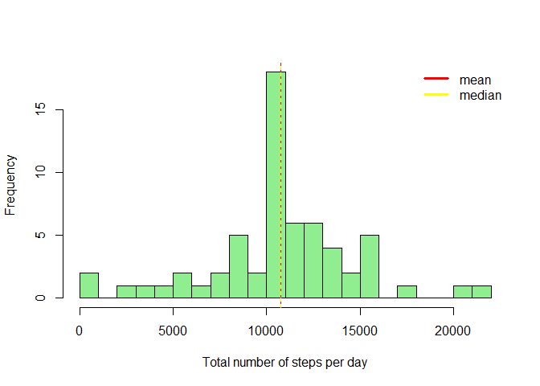
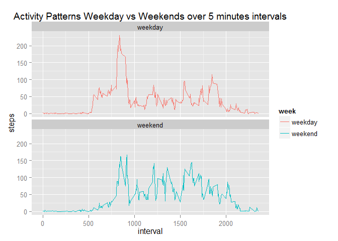

# Reproducible Research: Peer Assessment 1
This assignment makes use of data from a personal activity monitoring device. This device collects data at 5 minute intervals through out the day. The data consists of two months of data from an anonymous individual collected during the months of October and November, 2012 and include the number of steps taken in 5 minute intervals each day.

## A. Loading and preprocessing the data
The data file activitt.csv is extracted from activity.zip, and then loaded into a data frame. The structure of the data frame, a summary statistic , and some data are displayed.

```r
unzip("activity.zip")
activityData <- read.csv("activity.csv")
str(activityData)
```

```
## 'data.frame':	17568 obs. of  3 variables:
##  $ steps   : int  NA NA NA NA NA NA NA NA NA NA ...
##  $ date    : Factor w/ 61 levels "2012-10-01","2012-10-02",..: 1 1 1 1 1 1 1 1 1 1 ...
##  $ interval: int  0 5 10 15 20 25 30 35 40 45 ...
```

```r
summary(activityData)
```

```
##      steps               date          interval   
##  Min.   :  0.0   2012-10-01:  288   Min.   :   0  
##  1st Qu.:  0.0   2012-10-02:  288   1st Qu.: 589  
##  Median :  0.0   2012-10-03:  288   Median :1178  
##  Mean   : 37.4   2012-10-04:  288   Mean   :1178  
##  3rd Qu.: 12.0   2012-10-05:  288   3rd Qu.:1766  
##  Max.   :806.0   2012-10-06:  288   Max.   :2355  
##  NA's   :2304    (Other)   :15840
```

```r
head(activityData)
```

```
##   steps       date interval
## 1    NA 2012-10-01        0
## 2    NA 2012-10-01        5
## 3    NA 2012-10-01       10
## 4    NA 2012-10-01       15
## 5    NA 2012-10-01       20
## 6    NA 2012-10-01       25
```

```r
library(plyr)
# Process data to make it ready for plotting and analysis
dailyActivity <-  ddply(activityData, .(date), summarize, steps = sum(steps))
```


## B. What is mean total number of steps taken per day?

```r
# Calculate Summary Statistic
meanSteps <- mean(dailyActivity$steps, na.rm=T)
medianSteps<- median(dailyActivity$steps, na.rm=T)
```

#####1B.  Histogram of the total number of steps taken each day

```r
#Histogram of the total number of steps taken each day
hist(dailyActivity$steps, breaks=20,xlab="Total number of steps per day", main="Figure 1", col="light green")
abline(v=meanSteps, col = c("red"))
abline(v=medianSteps, col = c("yellow"), lty = 2)
legend(x="topright", legend=c("mean","median"), col=c("red","yellow"), bty="n", lwd=3)
```

 

#####2B. The mean and median number of steps taken per day are 10766 and 10765

## C. What is the average daily activity pattern?


```r
adai <- aggregate(formula=steps~interval, data=activityData,FUN=mean, na.rm=TRUE)
maxSteps <- max(adai$steps)
maxInterval <- adai[adai$steps==maxSteps,1]
```

#####1C. Time Series Plot of the 5-minute interval (x-axis) and the average number of steps taken, averaged across all days (y-axis)


```r
plot(adai$interval,adai$steps, main="Figure 2",xlab="Interval",ylab="Average number of steps per interval", type="l", lwd=2, col="blue")
abline(h=maxSteps, col = c("red"))
abline(v=maxInterval, col = c("green"))
```

 

#####2C. Which 5-minute interval, on average across all the days in the dataset, contains the maximum number of steps?

The interval 835 is the 5-minute interval, on avergage across all the days in the dataset that contatins the maximum number of steps of 206.1698.


## D. Imputing missing values


```r
missing <- nrow(activityData[is.na(activityData$steps),])
```

#####1D. There are 2304 rows with missing values.

#####2D. and  3D. Imputation Stragtegy, and Creating new dataset with missing data filled in.


```r
# Duplicate data
dData <- activityData


#replace missing values with mean total number of steps taken per day, not a good strategy, see below in notes 
#mInd <- which(is.na(dData$steps))
#dData[mInd,1] <- meanSteps

#replace missing values with median total number of steps taken per day, not a good strategy, see below in notes 
#mInd <- which(is.na(dData$steps))
#dData[mInd,1] <- medianSteps

#replace missing values with intervals steps means
mInd <- which(is.na(dData$steps))
dData[mInd,1] <- adai[as.factor(dData[mInd,3]),2]
```

From the observations of total steps taken per day and average steps taken per interval, it seems that there is more variation between the number of steps taken day to day (Figure 1, above) than in the average of steps taken during each interval across the different days (Figure 2, above). Given this, the imputation strategy I will follow is to complete the missing cases using the average number of steps from the corresponding interval. If we impute the missing value with the mean or median of total number of steps per day,  then the new mean is 415998.5 and new median 11458, which are very far off from the actual mean and median in part 1. I believe that replacing missing values shouldn't cause the mean, and median to deivate so much from the ones calculated with the missing values. 

#####4D. What is the NEW mean total number of steps taken per day?


```r
# Summary by day
newDailyActivity <-  ddply(dData, .(date), summarize, steps = sum(steps))

# Calculate Summary Statistic
newMeanSteps <-  mean(newDailyActivity$steps)
newMedianSteps<- median(newDailyActivity$steps)
```

######4.1D.  Histogram of the total number of steps taken each day with missing values filled

```r
#Histogram of the total number of steps taken each day
hist(newDailyActivity$steps, breaks=20,xlab="Total number of steps per day", main=NULL, col="light green")
abline(v=newMeanSteps, col = c("red"))
abline(v=newMedianSteps, col = c("yellow"), lty = 2)
legend(x="topright", legend=c("mean","median"), col=c("red","yellow"), bty="n", lwd=3)
```

 

######4.2D. The new mean and median number of steps taken per day are 10766 and 10766

######4.3D Do these values differ from the estimates from the first part of the assignment?


```r
#r1 <- c("mean",as.integer(meanSteps),as.integer(newMeanSteps))
#r2 <- c("median",medianSteps,as.integer(newMedianSteps))
r1 <- c("mean",meanSteps,newMeanSteps)
r2 <- c("median",medianSteps,newMedianSteps)
table1 <- rbind(r1,r2)
colnames(table1)<- c("Type","First Part","Second Part")
rownames(table1) <- c(1,2)
library(xtable)
```

```
## Warning: package 'xtable' was built under R version 3.1.2
```

```r
print(xtable(table1), type="html")
```

<!-- html table generated in R 3.1.1 by xtable 1.7-4 package -->
<!-- Fri Nov 14 15:12:37 2014 -->
<table border=1>
<tr> <th>  </th> <th> Type </th> <th> First Part </th> <th> Second Part </th>  </tr>
  <tr> <td align="right"> 1 </td> <td> mean </td> <td> 10766.1886792453 </td> <td> 10766.1886792453 </td> </tr>
  <tr> <td align="right"> 2 </td> <td> median </td> <td> 10765 </td> <td> 10766.1886792453 </td> </tr>
   </table>


The mean in the first part and the second part are the same. The median are different.


######4.4D What is the impact of imputing missing data on the estimates of the total daily number of steps?


```r
dmissing <-  nrow(dailyActivity[is.na(dailyActivity$steps),])
nmissing <-  nrow(newDailyActivity[is.na(newDailyActivity$steps),])
```

There is no difference in the mean of Part1 and Part2, but little difference in the median. 
There are 8 missing values for the daily number of steps in part 1, while second has 0 missing values. The part one where the values are missing the total daily number of steps is actually the mean value as seen in Part 2. (See Table Below)


```r
t1 <- merge(dailyActivity,newDailyActivity,by=1)
names(t1)<- c("Date","First Part","Second Part")
library(xtable)
print(xtable(t1), type="html")
```

<!-- html table generated in R 3.1.1 by xtable 1.7-4 package -->
<!-- Fri Nov 14 15:12:37 2014 -->
<table border=1>
<tr> <th>  </th> <th> Date </th> <th> First Part </th> <th> Second Part </th>  </tr>
  <tr> <td align="right"> 1 </td> <td> 2012-10-01 </td> <td align="right">  </td> <td align="right"> 10766.19 </td> </tr>
  <tr> <td align="right"> 2 </td> <td> 2012-10-02 </td> <td align="right"> 126 </td> <td align="right"> 126.00 </td> </tr>
  <tr> <td align="right"> 3 </td> <td> 2012-10-03 </td> <td align="right"> 11352 </td> <td align="right"> 11352.00 </td> </tr>
  <tr> <td align="right"> 4 </td> <td> 2012-10-04 </td> <td align="right"> 12116 </td> <td align="right"> 12116.00 </td> </tr>
  <tr> <td align="right"> 5 </td> <td> 2012-10-05 </td> <td align="right"> 13294 </td> <td align="right"> 13294.00 </td> </tr>
  <tr> <td align="right"> 6 </td> <td> 2012-10-06 </td> <td align="right"> 15420 </td> <td align="right"> 15420.00 </td> </tr>
  <tr> <td align="right"> 7 </td> <td> 2012-10-07 </td> <td align="right"> 11015 </td> <td align="right"> 11015.00 </td> </tr>
  <tr> <td align="right"> 8 </td> <td> 2012-10-08 </td> <td align="right">  </td> <td align="right"> 10766.19 </td> </tr>
  <tr> <td align="right"> 9 </td> <td> 2012-10-09 </td> <td align="right"> 12811 </td> <td align="right"> 12811.00 </td> </tr>
  <tr> <td align="right"> 10 </td> <td> 2012-10-10 </td> <td align="right"> 9900 </td> <td align="right"> 9900.00 </td> </tr>
  <tr> <td align="right"> 11 </td> <td> 2012-10-11 </td> <td align="right"> 10304 </td> <td align="right"> 10304.00 </td> </tr>
  <tr> <td align="right"> 12 </td> <td> 2012-10-12 </td> <td align="right"> 17382 </td> <td align="right"> 17382.00 </td> </tr>
  <tr> <td align="right"> 13 </td> <td> 2012-10-13 </td> <td align="right"> 12426 </td> <td align="right"> 12426.00 </td> </tr>
  <tr> <td align="right"> 14 </td> <td> 2012-10-14 </td> <td align="right"> 15098 </td> <td align="right"> 15098.00 </td> </tr>
  <tr> <td align="right"> 15 </td> <td> 2012-10-15 </td> <td align="right"> 10139 </td> <td align="right"> 10139.00 </td> </tr>
  <tr> <td align="right"> 16 </td> <td> 2012-10-16 </td> <td align="right"> 15084 </td> <td align="right"> 15084.00 </td> </tr>
  <tr> <td align="right"> 17 </td> <td> 2012-10-17 </td> <td align="right"> 13452 </td> <td align="right"> 13452.00 </td> </tr>
  <tr> <td align="right"> 18 </td> <td> 2012-10-18 </td> <td align="right"> 10056 </td> <td align="right"> 10056.00 </td> </tr>
  <tr> <td align="right"> 19 </td> <td> 2012-10-19 </td> <td align="right"> 11829 </td> <td align="right"> 11829.00 </td> </tr>
  <tr> <td align="right"> 20 </td> <td> 2012-10-20 </td> <td align="right"> 10395 </td> <td align="right"> 10395.00 </td> </tr>
  <tr> <td align="right"> 21 </td> <td> 2012-10-21 </td> <td align="right"> 8821 </td> <td align="right"> 8821.00 </td> </tr>
  <tr> <td align="right"> 22 </td> <td> 2012-10-22 </td> <td align="right"> 13460 </td> <td align="right"> 13460.00 </td> </tr>
  <tr> <td align="right"> 23 </td> <td> 2012-10-23 </td> <td align="right"> 8918 </td> <td align="right"> 8918.00 </td> </tr>
  <tr> <td align="right"> 24 </td> <td> 2012-10-24 </td> <td align="right"> 8355 </td> <td align="right"> 8355.00 </td> </tr>
  <tr> <td align="right"> 25 </td> <td> 2012-10-25 </td> <td align="right"> 2492 </td> <td align="right"> 2492.00 </td> </tr>
  <tr> <td align="right"> 26 </td> <td> 2012-10-26 </td> <td align="right"> 6778 </td> <td align="right"> 6778.00 </td> </tr>
  <tr> <td align="right"> 27 </td> <td> 2012-10-27 </td> <td align="right"> 10119 </td> <td align="right"> 10119.00 </td> </tr>
  <tr> <td align="right"> 28 </td> <td> 2012-10-28 </td> <td align="right"> 11458 </td> <td align="right"> 11458.00 </td> </tr>
  <tr> <td align="right"> 29 </td> <td> 2012-10-29 </td> <td align="right"> 5018 </td> <td align="right"> 5018.00 </td> </tr>
  <tr> <td align="right"> 30 </td> <td> 2012-10-30 </td> <td align="right"> 9819 </td> <td align="right"> 9819.00 </td> </tr>
  <tr> <td align="right"> 31 </td> <td> 2012-10-31 </td> <td align="right"> 15414 </td> <td align="right"> 15414.00 </td> </tr>
  <tr> <td align="right"> 32 </td> <td> 2012-11-01 </td> <td align="right">  </td> <td align="right"> 10766.19 </td> </tr>
  <tr> <td align="right"> 33 </td> <td> 2012-11-02 </td> <td align="right"> 10600 </td> <td align="right"> 10600.00 </td> </tr>
  <tr> <td align="right"> 34 </td> <td> 2012-11-03 </td> <td align="right"> 10571 </td> <td align="right"> 10571.00 </td> </tr>
  <tr> <td align="right"> 35 </td> <td> 2012-11-04 </td> <td align="right">  </td> <td align="right"> 10766.19 </td> </tr>
  <tr> <td align="right"> 36 </td> <td> 2012-11-05 </td> <td align="right"> 10439 </td> <td align="right"> 10439.00 </td> </tr>
  <tr> <td align="right"> 37 </td> <td> 2012-11-06 </td> <td align="right"> 8334 </td> <td align="right"> 8334.00 </td> </tr>
  <tr> <td align="right"> 38 </td> <td> 2012-11-07 </td> <td align="right"> 12883 </td> <td align="right"> 12883.00 </td> </tr>
  <tr> <td align="right"> 39 </td> <td> 2012-11-08 </td> <td align="right"> 3219 </td> <td align="right"> 3219.00 </td> </tr>
  <tr> <td align="right"> 40 </td> <td> 2012-11-09 </td> <td align="right">  </td> <td align="right"> 10766.19 </td> </tr>
  <tr> <td align="right"> 41 </td> <td> 2012-11-10 </td> <td align="right">  </td> <td align="right"> 10766.19 </td> </tr>
  <tr> <td align="right"> 42 </td> <td> 2012-11-11 </td> <td align="right"> 12608 </td> <td align="right"> 12608.00 </td> </tr>
  <tr> <td align="right"> 43 </td> <td> 2012-11-12 </td> <td align="right"> 10765 </td> <td align="right"> 10765.00 </td> </tr>
  <tr> <td align="right"> 44 </td> <td> 2012-11-13 </td> <td align="right"> 7336 </td> <td align="right"> 7336.00 </td> </tr>
  <tr> <td align="right"> 45 </td> <td> 2012-11-14 </td> <td align="right">  </td> <td align="right"> 10766.19 </td> </tr>
  <tr> <td align="right"> 46 </td> <td> 2012-11-15 </td> <td align="right">  41 </td> <td align="right"> 41.00 </td> </tr>
  <tr> <td align="right"> 47 </td> <td> 2012-11-16 </td> <td align="right"> 5441 </td> <td align="right"> 5441.00 </td> </tr>
  <tr> <td align="right"> 48 </td> <td> 2012-11-17 </td> <td align="right"> 14339 </td> <td align="right"> 14339.00 </td> </tr>
  <tr> <td align="right"> 49 </td> <td> 2012-11-18 </td> <td align="right"> 15110 </td> <td align="right"> 15110.00 </td> </tr>
  <tr> <td align="right"> 50 </td> <td> 2012-11-19 </td> <td align="right"> 8841 </td> <td align="right"> 8841.00 </td> </tr>
  <tr> <td align="right"> 51 </td> <td> 2012-11-20 </td> <td align="right"> 4472 </td> <td align="right"> 4472.00 </td> </tr>
  <tr> <td align="right"> 52 </td> <td> 2012-11-21 </td> <td align="right"> 12787 </td> <td align="right"> 12787.00 </td> </tr>
  <tr> <td align="right"> 53 </td> <td> 2012-11-22 </td> <td align="right"> 20427 </td> <td align="right"> 20427.00 </td> </tr>
  <tr> <td align="right"> 54 </td> <td> 2012-11-23 </td> <td align="right"> 21194 </td> <td align="right"> 21194.00 </td> </tr>
  <tr> <td align="right"> 55 </td> <td> 2012-11-24 </td> <td align="right"> 14478 </td> <td align="right"> 14478.00 </td> </tr>
  <tr> <td align="right"> 56 </td> <td> 2012-11-25 </td> <td align="right"> 11834 </td> <td align="right"> 11834.00 </td> </tr>
  <tr> <td align="right"> 57 </td> <td> 2012-11-26 </td> <td align="right"> 11162 </td> <td align="right"> 11162.00 </td> </tr>
  <tr> <td align="right"> 58 </td> <td> 2012-11-27 </td> <td align="right"> 13646 </td> <td align="right"> 13646.00 </td> </tr>
  <tr> <td align="right"> 59 </td> <td> 2012-11-28 </td> <td align="right"> 10183 </td> <td align="right"> 10183.00 </td> </tr>
  <tr> <td align="right"> 60 </td> <td> 2012-11-29 </td> <td align="right"> 7047 </td> <td align="right"> 7047.00 </td> </tr>
  <tr> <td align="right"> 61 </td> <td> 2012-11-30 </td> <td align="right">  </td> <td align="right"> 10766.19 </td> </tr>
   </table>


##E. Are there differences in activity patterns between weekdays and weekends?


```r
weekend <-  c("Sunday", "Saturday")
dData$day <- weekdays(as.Date(dData$date))
dFactor <- levels(factor(dData$day))
dData$week <- "weekday"
dData[dData$day %in% weekend,5] <- "weekend"
dData$week <- as.factor(dData$week)

asiw <- ddply(dData,.(interval,week),summarize, steps=mean(steps,na.rm=T))
asiwMax <- max(asiw$steps)
asiwInt <- asiw[asiw$steps==asiwMax,1]
library(ggplot2)
ggplot(data=asiw, aes(x=interval, y=steps, group=week))+ ggtitle("Activity Patterns Weekday vs Weekends over 5 minutes intervals") + geom_line(aes(color=week))+ facet_wrap(~ week, nrow=2)
```

 

We can observe from the above plot that the activity on the weekdays has the greatest peak from all steps intervals, but we can also observe weekends activities have more peaks over a hundred than weekdays. This could be attributed to the fact that activities on the weekdays mostly follow a work related routine, where we can see some intense activities in a small amount of time which employ can spare some time for. Over the weekend we see a better distribution of efforts along the time. During the weekend it is some what stays in a range which is not too wide as compare to weekdays range.


